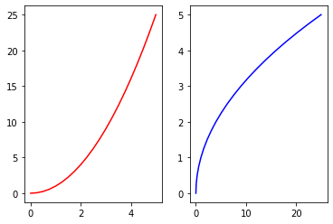
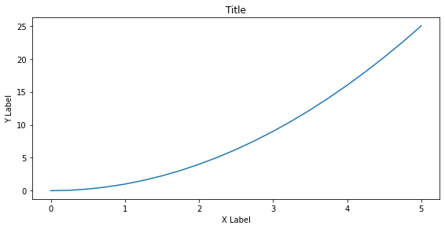
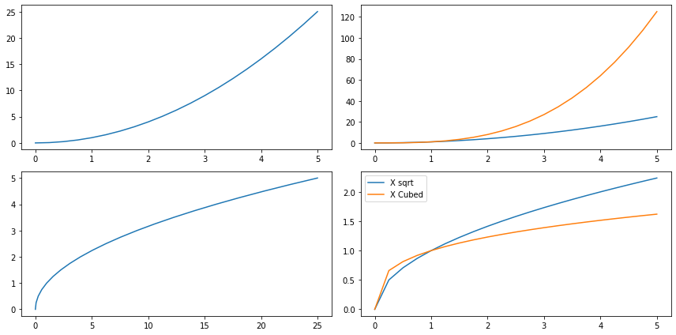

```python
import matplotlib.pyplot as plt
%matplotlib inline
import numpy as np
```


```python
x = np.linspace(0, 5, 21)
y = x ** 2
```


```python
#Functional
plt.plot(x, y, 'r-')
plt.xlabel('X')
plt.ylabel('Y')
plt.show()
```


```python
plt.subplot(1, 2, 1)
plt.plot(x, y, 'r')
plt.subplot(1, 2, 2)
plt.plot(y, x, 'b')
plt.show()
```





```python
# oo
fig = plt.figure()
axes = fig.add_axes([0.1, 0.1, 1.2, 0.8])
axes.plot(x, y)
axes.set_xlabel('X Label')
axes.set_ylabel('Y Label')
axes.set_title('Title')
plt.show()
```





```python
fig = plt.figure()
axes1 = fig.add_axes([0.1, 0.1, 0.8, 0.8])
axes2 = fig.add_axes([0.2, 0.5, 0.4, 0.3])
axes1.plot(x, y)
axes1.set_title('Title')
axes2.plot(y, x)
axes2.set_title('Sub Title')
```


    Text(0.5, 1.0, 'Sub Title')


```python
fig, axes = plt.subplots(nrows = 1, ncols = 2)

for current_ax in axes:
    current_ax.plot(x, y)
    current_ax.set_title("title")
    
```


```python
axes[0].plot(x, y)
axes[0].set_title("First Plot")
axes[1].plot(y, x)
axes[1].set_title("Second Plot")
```


    Text(0.5, 1.0, 'Second Plot')


# Figure Size and DPI


```python
fig = plt.figure(figsize=(8, 2), dpi=200)
ax = fig.add_axes([0, 0, 1, 1])
ax.plot(x, y)
plt.show()
```


```python
fig = plt.figure(figsize=(8, 2), dpi=20)
ax = fig.add_axes([0, 0, 1, 1])
ax.plot(x, y)
plt.show()
```


```python
fig, axes = plt.subplots(nrows=2, ncols=2, figsize=(12, 6))

axes[0][0].plot(x, y)
axes[1][0].plot(y, x)

axes[0][1].plot(x, x ** 2)
axes[0][1].plot(x, x ** 3)

axes[1][1].plot(x, x ** 0.5, label='X sqrt')
axes[1][1].plot(x, x ** 0.3, label='X Cubed')
axes[1][1].legend()

plt.tight_layout()

```





```python
fig.savefig('figure_test.png', dpi=200)
```


```python
fig = plt.figure()
ax = fig.add_axes([0, 0, 1, 1])
ax.plot(x, y, color = '#FF8C00', linewidth=2, alpha=0.5, linestyle='--', 
        marker='o', markersize=20, markerfacecolor='yellow', markeredgecolor='red', markeredgewidth=3)

ax.set_xlim([0, 1])
ax.set_ylim([0, 2])
plt.show()
```


```python

```
